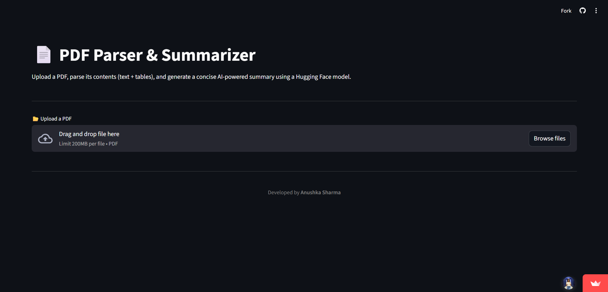
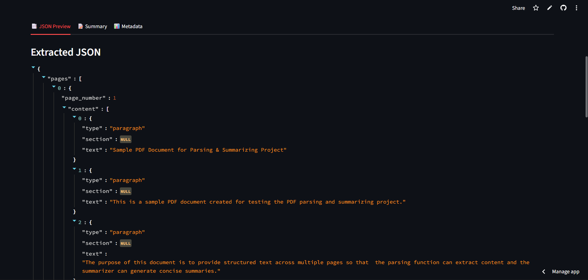
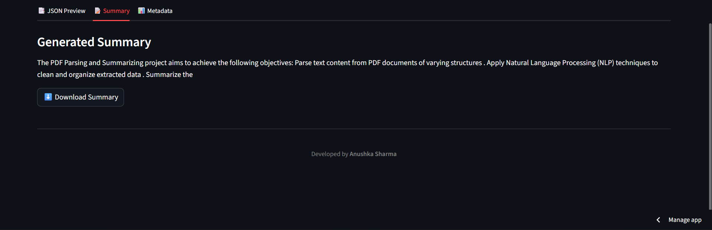
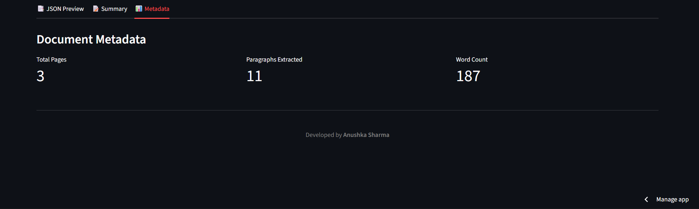

# 📄 PDF Parser & Summarizer | Document AI | NLP | Data Extraction  

---

## 🔰 Introduction  
This project is an **AI-powered PDF Parser & Summarizer** that goes beyond the basic requirement of extracting structured content from PDFs.  

- It parses PDF documents into a **well-structured JSON format** (capturing sections, paragraphs, and tables).  
- It also integrates a **state-of-the-art Hugging Face summarization model** to generate **concise summaries** of the extracted text and tables.  

This makes the tool highly useful for anyone who needs **both structured data extraction and AI-driven insights**—a strong value-add over traditional parsers.  

---

## 🔗 Links  
- 🚀 **Live Demo (Streamlit App):** [pdfparsersummarizer.streamlit.app](https://pdfparsersummarizer.streamlit.app/)  
- 🤗 **Hugging Face Model Used:** [sshleifer/distilbart-cnn-12-6](https://huggingface.co/sshleifer/distilbart-cnn-12-6)  

---

## 🖼️ Project Preview  


---

## ✨ Features  
- 📂 **PDF Parsing** → Extracts paragraphs, sections, and tables with page-level hierarchy.  
- 📝 **AI Summarization (USP)** → Generates concise summaries using a Hugging Face Transformer model.  
- 📊 **Metadata Insights** → Displays number of pages, extracted paragraphs, and word count.  
- ⬇️ **Export Options** → Download parsed JSON and summary as files.  
- 🌐 **Streamlit Web App** → User-friendly, interactive interface.  
- ⚡ **Robust Parsing** → Handles multiple content formats (text + tables).  
- 🎨 **Clean UI** → JSON viewer, summary tab, and interactive metrics.  

---

## 🛠️ Tools & Technologies  

| **Category**      | **Technologies** |
|-------------------|------------------|
| Programming       | Python |
| Frontend (UI)     | Streamlit |
| NLP Model         | Hugging Face Transformers (`sshleifer/distilbart-cnn-12-6`) |
| Deep Learning     | PyTorch |
| PDF Parsing       | PyMuPDF (`fitz`), pdfplumber |
| Utilities         | tqdm, sentencepiece |
| Deployment        | Streamlit Cloud |

---

## ⚙️ How It Works  

1. **Upload PDF**  
   - User uploads any PDF file via the Streamlit app.  

2. **Parsing Stage**  
   - `parser.py` uses **PyMuPDF** and **pdfplumber** to:  
     - Extract text and detect sections/sub-sections.  
     - Identify and extract tables.  
     - Structure everything into a clean JSON format with metadata.  

3. **Summarization Stage (USP)**  
   - `summarizer.py` loads the Hugging Face model `sshleifer/distilbart-cnn-12-6`.  
   - Text is tokenized and either summarized directly (short docs) or chunked into parts (long docs).  
   - Extracted tables are included as **table snippets** in the summary.  
   - A **meta-summary** condenses chunked outputs into a final concise overview.  

4. **Visualization & Output**  
   - Parsed JSON → displayed in an expandable JSON viewer.  
   - AI Summary → shown in a dedicated summary tab.  
   - Metadata → displayed with Streamlit metric cards.  
   - Both JSON and summary → available for download.  

---

## 👀 Preview (App Tabs)  
- **📑 JSON Preview:** 
- **📝 Summary:**  
- **📊 Metadata:** 

---

## 📂 Folder Structure  
```
PDFParserSummarizer/
│── app.py   # Streamlit frontend
│── parser.py   # PDF parsing logic
│── summarizer.py   # Hugging Face summarization logic
│── requirements.txt   # Dependencies
└── README.md   # Documentation
```

---

## 💡 Use Cases  
- 📚 **Research Papers** → Parse and summarize lengthy academic PDFs.  
- 📈 **Business Reports** → Extract tables + text, then summarize into insights.  
- 🏛️ **Legal Documents** → Get concise summaries of contracts or case files.  
- 📰 **Articles/Whitepapers** → Quickly digest long documents.  
- 🗄️ **General Archival** → Store both structured JSON and human-readable summary.  

---

## ⚡ Setup Instructions  

### 1. Clone the Repository  
```bash
git clone https://github.com/your-username/pdf-parser-summarizer.git
cd pdf-parser-summarizer
```

### 2. Create Virtual Environment (Recommended)
```
python -m venv venv
source venv/bin/activate   # On Mac/Linux
venv\Scripts\activate      # On Windows
```

### 3. Install Dependencies
```
pip install -r requirements.txt
```

### 4. Run Locally
```
streamlit run app.py
```

---

## 🌟 Unique Selling Point (USP)  

Unlike typical PDF parsers that only **extract raw content**, this project integrates **AI-powered summarization**.  

- Summarization works seamlessly with extracted **text and tables**.  
- Handles **long documents** using intelligent chunking.  
- Produces **clear, concise insights** in addition to structured JSON.  

This **combination of Parsing + Summarization** makes the project stand out as a **Document AI system**, not just a parser.  

---

## 🙋‍♀️ Author

**Anushka Sharma**  
🌐 [LinkedIn](https://www.linkedin.com/in/anushkasharma008/) • 🐱 [GitHub](https://github.com/Anushka-Sharma-008) 
🎓 Learning Data Science, Analytics & Machine Learning

---

## ⭐ Show Your Support

If you found this project helpful or inspiring:

- ⭐ Star this repository  
- 🛠️ Fork it to build upon or adapt it for your own use  
- 💬 Share feedback or suggestions via Issues/Discussions
